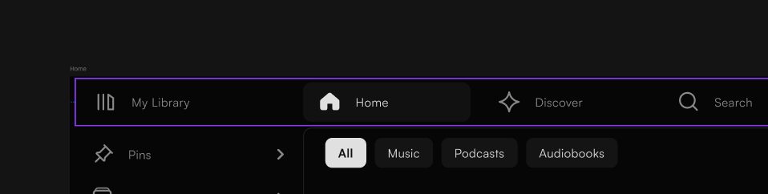
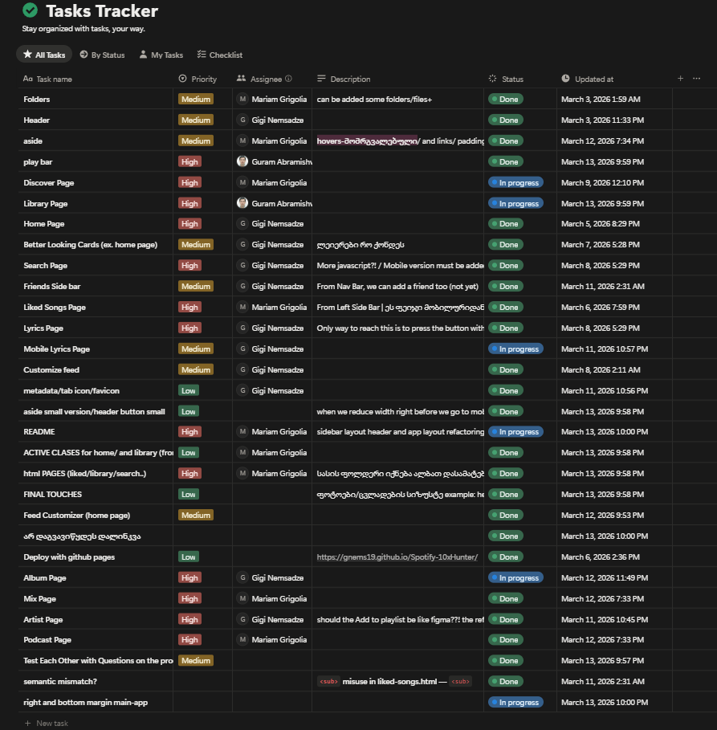
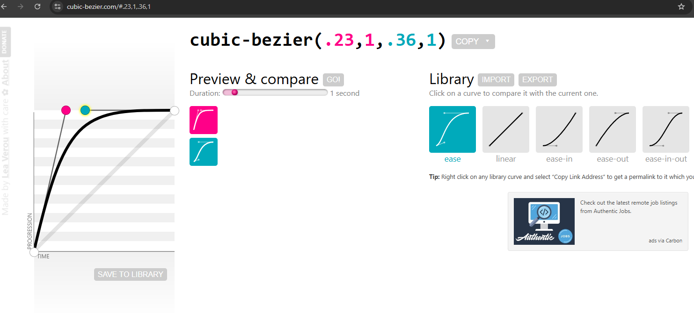

# Spotify-10xHunter

## Project Overview
A Spotify Web UI clone built as a team markup exam for 10X Academy (Frontend module). The project replicates Spotify's desktop and mobile layouts based on a provided Figma design, using only HTML, CSS/SCSS, and vanilla JavaScript — no frameworks.

## Team Contributions

| Team Member | Role | Owned Scope |
|---|---|---|
| **Gigi Nemsadze** | Team Lead | Repo setup, layout architecture, Navbar, Homepage (feed + filter bar + modal), Search page, Artist page, Lyrics page, Layered cards, Friends window, Mobile search, Metadata & SEO, Accessibility (screen reader headings) |
| **Mariam Grigolia** | Developer | SCSS structure & base styles, Sidebar (with hover/accordion), Liked Songs page, Discovery page, Mix page, Podcast page, Responsive layout adjustments |
| **Guram Abramishvili** | Developer / PR Reviewer | Player (HTML structure + desktop design), Library page (in progress), SCSS refactor, reviewed and merged multiple PRs (#10, #12, #13, #14, #15) |

> Full contribution history is visible in the [git log](https://github.com/Gnems19/Spotify-10xHunter/commits/main) and [pull requests](https://github.com/Gnems19/Spotify-10xHunter/pulls?q=is%3Apr+is%3Aclosed).

## Team Decisions

### Development Approach
- We built the project **Mobile First**, starting with small-screen structure and scaling up to desktop.
- Used **Flexbox** as the primary layout method after group discussions on how to structure the main grid (sidebar + main content + player).

### Layout Discussion
Early on, we had a key debate: **does the "My Library" button belong to the header or to the sidebar?** In the Figma design, it visually sits at the boundary between the two. After discussing it in our online calls, we agreed to treat it as part of the sidebar navigation on desktop, while on mobile it becomes a top-level nav item in the header bar.

### Task Management
We tracked tasks using a shared task board, with each member assigned clear responsibilities upfront.

### Team Communication
- We regularly held **online meetups** (group calls) to discuss progress, review code structure, analyze each other's implementations, and resolve blockers.
- Beyond calls, we collaborated through **pull request reviews and comments** — you can trace these discussions in the PR history.

### Naming Convention
- We independently arrived at the same conclusion: use **BEM** (`block__element--modifier`) for CSS class naming — no camelCase.
- This wasn't a top-down rule; each member naturally gravitated toward BEM during their own work, and when we compared code in our meetups, we found we were already consistent.

### Technical Research
We researched specific CSS details together, such as custom `cubic-bezier` timing functions for smooth animations on hover and transitions.

### Team Lead
- **Gigi Nemsadze** served as Team Lead.
- Responsibilities: repo initialization, layout architecture decisions, task coordination, PR reviews, and keeping the team aligned on structure and conventions.

## Workflow
- Each feature was developed on its own branch (`feat/sidebar`, `feat/homepage`, `feat/player`, etc.).
- Changes were integrated through **pull requests** (18 PRs merged in total).
- Team members reviewed each other's PRs before merging — no direct pushes to main.
- We used meaningful branch names following the `feat/`, `fix/`, `feature/`, `docs/` convention.

## Tech Stack
- HTML
- CSS / SASS (7-1 pattern: abstracts, base, components, layout, pages)
- JavaScript (vanilla)
- Git / GitHub

## Design Source
UI design from Figma: [10X markup exam project - Spotify](https://www.figma.com/design/jrlUWJdbxTc2bKd5dpRa5r/10X-markup-exam-project---Spotify?node-id=3-2&p=f&t=ZiXIWVMt67o0cfaO-0)
